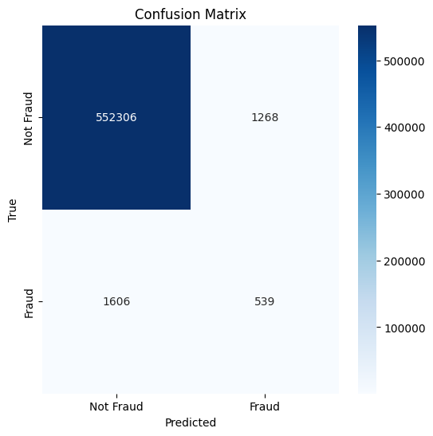
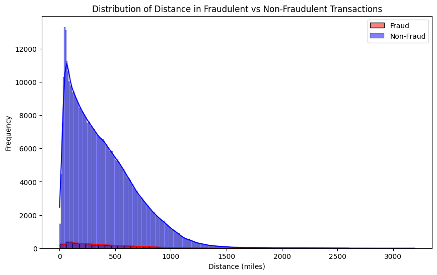
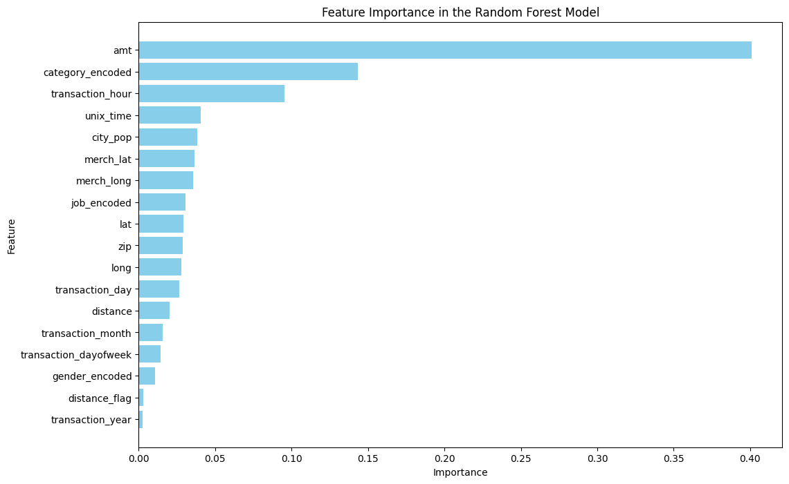

# FraudDetection
Group 1: Finance - FraudDetection

In this analysis, we are exploring the hypothesis that if the geographic distance between the retailer’s location (represented by merch_lat and merch_long) and the cardholder’s address (represented by lat and long) exceeds 200 miles, it could be an indicator of fraudulent activity. To test this theory, we will calculate the distance between these two points using the Haversine formula. We will then use this distance as a feature in a supervised classification model to predict whether a transaction is fraudulent. The model chosen for this task is a Random Forest classifier due to its ability to handle complex patterns in large datasets. Finally, we will evaluate the model’s performance and visualize key results, such as the distribution of distances in fraudulent vs. non-fraudulent transactions and the confusion matrix, to assess the model's accuracy and fraud detection ability.

Questions we answered with our analysis  -
Question 1: What distances are cases of fraud more prevelent?
Question 2: Which characteristic of a transaction is the most important in spotting fraud?

