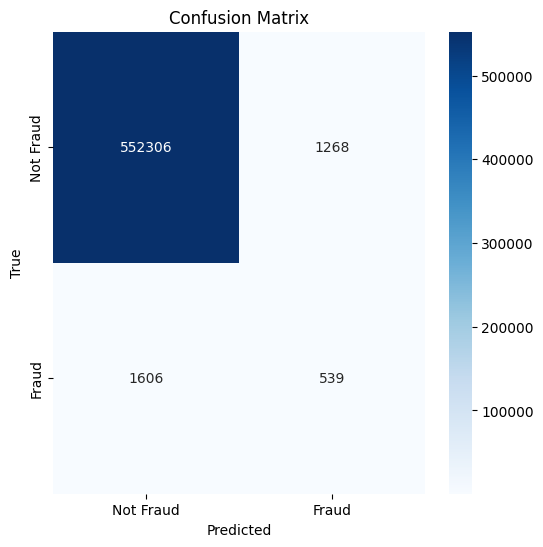
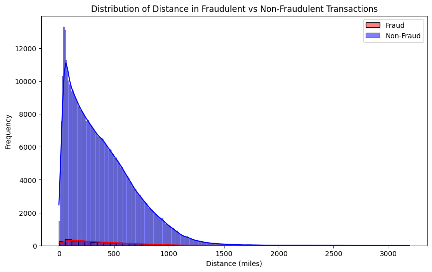
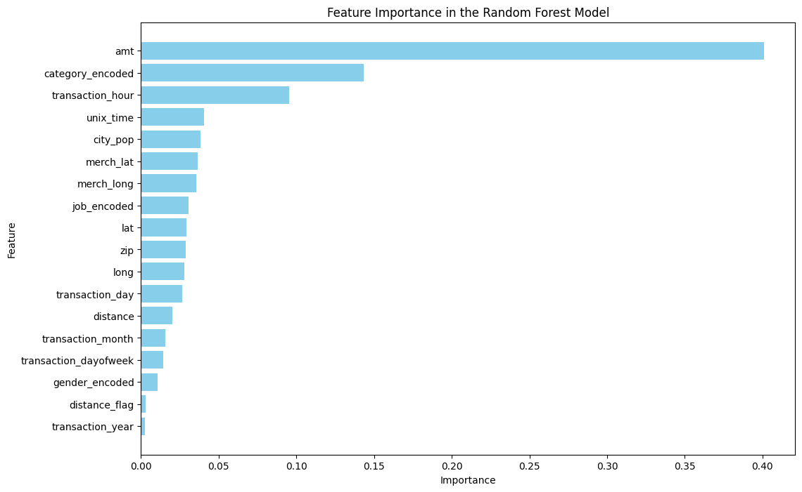

# Transaction Fraud Detection Using Random Forest
### Group 1: Finance - Fraud Detection Analysis

In this analysis, we explore the hypothesis that if the geographic distance between the retailer’s location (represented by `merch_lat` and `merch_long`) and the cardholder’s address (represented by `lat` and `long`) exceeds 200 miles, it could indicate fraudulent activity. To test this theory, we calculate the distance between these two points using the Haversine formula. This distance is then used as a feature in a supervised classification model to predict whether a transaction is fraudulent. We selected a **Random Forest** classifier for its ability to handle complex patterns in large datasets. Finally, we evaluate the model’s performance and visualize key results, such as the distribution of distances in fraudulent vs. non-fraudulent transactions and the confusion matrix, to assess the model's accuracy in fraud detection.

### Key Questions Answered:
- **Question 1**: At what distances are fraudulent transactions more prevalent?
- **Question 2**: Which characteristics of a transaction are the most important in detecting fraud?

## Confusion Matrix

In the confusion matrix:
- **True Positives (TP)**: 539
- **False Positives (FP)**: 1,268
- **True Negatives (TN)**: 552,306
- **False Negatives (FN)**: 1,606

## Distance Distribution in Fraudulent vs Non-Fraudulent Transactions

### Interpretation of Distance Distribution:

This graph illustrates the distribution of distances (in miles) between the cardholder's address and the retailer's location for both **fraudulent** and **non-fraudulent** transactions.

- **Non-Fraudulent Transactions** (blue curve):
  - The majority of non-fraudulent transactions occur at shorter distances, with a sharp peak around the 0-100 mile range.
  - As the distance increases, the frequency of non-fraudulent transactions decreases rapidly, with very few non-fraudulent transactions occurring at distances greater than 1,000 miles.
  
- **Fraudulent Transactions** (red curve):
  - Fraudulent transactions show a wider range of distances, though most are still concentrated around shorter distances.
  - However, there is a noticeable tail in the distribution, indicating that a greater proportion of fraudulent transactions occur at larger distances (over 500 miles and even beyond 1,000 miles) compared to non-fraudulent ones.

### Synopsis of Findings:

- The model’s analysis of the **distance** feature suggests that **shorter distances** (below 100 miles) are common for both non-fraudulent and fraudulent transactions.
- Fraudulent transactions, however, tend to occur over a wider range of distances, particularly at larger distances (e.g., over 500 miles). This aligns with the hypothesis that fraudulent transactions are more likely to involve greater geographic separation between the cardholder’s address and the retailer's location.
- **Key Insight**: Distance between the cardholder and retailer is a valuable feature for identifying potential fraud. Transactions occurring over longer distances should be scrutinized more carefully as they have a higher likelihood of being fraudulent.

## Feature Importance in the Random Forest Model

### Interpretation of Feature Importance:

The feature importance graph shows the contribution of each feature in predicting whether a transaction is fraudulent.

- **Transaction Amount (`amt`)**: The most important feature in detecting fraud. Higher transaction amounts could be more indicative of fraud, as fraudulent transactions often involve unusually high or low amounts.
  
- **Category (`category_encoded`)**: The second most important feature. The type of merchant or transaction category (e.g., travel, entertainment, or personal care) can be significant in identifying fraudulent behavior.
  
- **Transaction Hour (`transaction_hour`)**: Time of transaction is also a strong predictor, with certain hours of the day (e.g., late night or early morning) potentially being more prone to fraud.

- **Distance (`distance`)**: While distance is a relevant feature, especially for identifying fraud at longer distances (as shown in the distance distribution), it does not appear to be as strong a predictor when compared to other features such as transaction amount and category. This suggests that while geographic separation between the cardholder and the merchant is a factor, other features are more predictive of fraud in this dataset.

### Synopsis of Findings:

- **Key Insight**: While geographic distance is relevant, the most critical predictors of fraud in this dataset are the **transaction amount**, **merchant category**, and the **time of the transaction**. These features should be prioritized in future models to enhance fraud detection.

## Model Performance Metrics

| Metric                | Class 0 (Non-Fraudulent) | Class 1 (Fraudulent) | Overall |
|-----------------------|-------------------------|---------------------|---------|
| **Precision**          | 1.00                    | 0.30                | 0.99    |
| **Recall**             | 1.00                    | 0.25                | 0.99    |
| **F1-Score**           | 1.00                    | 0.27                | 0.99    |
| **Support**            | 553,574                 | 2,145               | 555,719 |

*Note: The support column indicates the number of occurrences of each class in the dataset.*

### Synopsis of Findings:

The **Random Forest** model demonstrated high accuracy (99%) in predicting non-fraudulent transactions but struggled to detect fraudulent transactions effectively.

- **Non-Fraudulent Transactions (Class 0)**: 
  - The model performed exceptionally well in identifying non-fraudulent transactions, achieving perfect precision, recall, and F1-scores. 
  - This is reflected in the high **True Negatives (552,306)** and **precision of 1.00**, meaning that all predicted non-fraudulent transactions were indeed correct.

- **Fraudulent Transactions (Class 1)**:
  - The model struggled more with fraudulent transactions. The **precision** for fraud detection was **30%**, meaning that when the model predicted a transaction to be fraudulent, it was only correct 30% of the time. 
  - The **recall** for fraud detection was **25%**, indicating that the model was able to identify only 25% of the actual fraud cases, missing a significant portion of them (1,606 false negatives).

- **Key Insight**: The performance metrics indicate that the model excels at detecting non-fraudulent transactions due to the **class imbalance** in the dataset (with far more non-fraudulent transactions than fraudulent ones). 
  - To improve the model's ability to detect fraud, techniques such as **class imbalance handling** (e.g., **SMOTE** or adjusting class weights) or incorporating additional features could help enhance performance in identifying fraudulent cases.

### Data Collection and Preprocessing

The dataset includes over 500,000 transactions with fields such as transaction amounts, cardholder location (`lat`, `long`), and merchant location (`merch_lat`, `merch_long`). We used the **Haversine formula** to calculate the distance between the cardholder and merchant locations as a feature.

Preprocessing steps included:
- **Handling Missing Data**: The dataset were examined for missing values, and no missing data was found, so no imputation or filling was necessary.
- **Encoding Categorical Variables**: Variables such as transaction category and gender were label-encoded.
- **Feature Scaling**: Numerical features such as transaction amount were standardized.

The dataset was then split into training and testing sets to evaluate model performance.

### Future Research and Next Steps

For a future iteration of this project, we would focus on the following:
- **Testing Other Models**: Exploring models such as **XGBoost** or **Gradient Boosting** could lead to better fraud detection performance.
- **Feature Engineering**: Further analysis of additional features such as transaction metadata, cardholder behavior, or temporal patterns could help boost the accuracy of fraud predictions.

## Technical Details

- **Dataset**: The dataset was sourced from [Kaggle](https://www.kaggle.com/datasets/kartik2112/fraud-detection/) and processed using Python libraries including **pandas** for data manipulation and **matplotlib** and **seaborn** for visualizations. The distance between cardholder and merchant locations was calculated using the Haversine formula.
  
- **Libraries Used**: 
  - **pandas**: For data cleaning and manipulation
  - **numpy**: For numerical operations and distance calculations
  - **matplotlib & seaborn**: For creating visualizations such as the confusion matrix, distance distribution, and feature importance plots
  - **scikit-learn**: For implementing the Random Forest model and evaluating performance metrics like precision, recall, and F1-score

- **Environment**: The analysis was conducted using **Google Colab** and **Jupyter Notebooks** to ensure clarity, reproducibility, and ease of collaboration. The project can be executed in any Python environment that supports the aforementioned libraries.

- **Code**: All scripts for data processing, feature engineering, model training, and evaluation are included in this repository. The repository is structured for easy navigation through each phase of the analysis.

### Team Members
- Elijah Mercier
- Ivanna Price
- Terry Brown